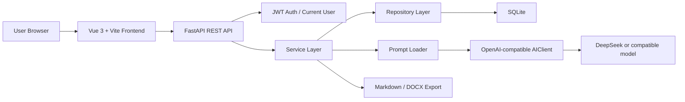

# ResumeFit Architecture

ResumeFit 采用前后端分离架构。前端负责流程引导、表单输入、历史记录、导出操作和用户体验；后端负责鉴权、数据隔离、AI 调用编排、结构化结果保存和文件导出。

## 总体架构

## 前端模块

- `frontend/src/pages/`: 页面级视图，包括 Dashboard、简历、项目、JD、分析、版本、用量、账户和管理后台。
- `frontend/src/components/`: 可复用组件，包括空状态、加载按钮、折叠区、详情弹窗和简历版本业务组件。
- `frontend/src/api/`: 前端 API 封装，统一调用后端接口。
- `frontend/src/auth/`: token 和当前用户状态管理。
- `frontend/src/router/`: 路由守卫，未登录用户跳转登录页。

## 后端模块

- `api/routes/`: FastAPI 路由层，只处理请求、依赖注入和响应。
- `schemas/`: Pydantic 请求和响应模型。
- `models/`: SQLAlchemy 数据模型。
- `repositories/`: 数据访问层，负责按用户过滤和持久化。
- `services/`: 业务逻辑层，负责 AI 编排、跨表校验、导出和统计。
- `ai/`: `AIClient` 与 Prompt Loader。
- `core/`: 配置、数据库初始化和安全工具。

## AI 调用链路

1. 用户在前端触发 JD 分析、匹配报告、简历生成、真实性检测或面试追问。
2. 前端携带 `Authorization: Bearer <token>` 调用后端。
3. 后端通过 JWT 获取当前用户，并校验相关资源归属。
4. Service 读取用户简历、项目、JD、分析报告和历史结果。
5. Prompt Loader 加载 `prompts/` 中的模板和真实性规则。
6. `AIClient` 调用 OpenAI-compatible 模型。
7. Service 解析结构化 JSON，保存结果和 AI 调用日志。

## 用户隔离

所有核心业务数据都通过 `user_id` 关联用户。后端 route 不信任前端传入的用户 ID，而是统一从 JWT 当前用户中获取 `current_user.id`。访问其他用户资源时返回 404 或 403，避免泄露资源存在性。

## 导出能力

- Markdown 导出直接返回 `ResumeVersion.content_markdown`。
- DOCX 导出使用 `python-docx` 在内存中生成文件，不长期保存到公开目录。
- 导出接口沿用用户隔离，普通用户只能导出自己的简历版本。

## 设计边界

当前项目不包含支付、会员套餐、订单、招聘网站爬取、自动投递和复杂权限系统。管理后台仅提供基础用户与用量查看、账号启用/禁用能力。
